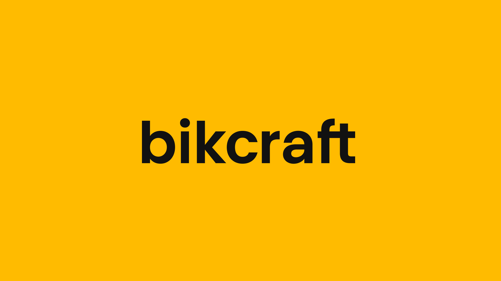

## 📌 Índice

- [Sobre](#-sobre)
- [Tecnologias utilizadas](#-tecnologias-utilizadas)
- [Como baixar o projeto](#-como-baixar-o-projeto)

---

## 🔖 Sobre

Esse é o projeto final do curso de HTML e CSS da Origamid que consiste em um site institucional para uma empresa de bicicletas, a **Bikcraft**. Além disso, houve uma pequena introdução ao JavaScript e algumas interações do site foram feitos por meio dessa linguagem, por exemplo: as animações de entrada. Algumas outras interações foram construídas com HTML e CSS puro, mostrando o quanto essas duas tecnologias estão versáteis atualmente.

<h3 align="center">
    <a href="https://bagrielz.github.io/bikcraft-project/">Acessar a demonstração</a>
<h3>

---

## 🚀 Tecnologias utilizadas

O projeto foi desenvolvido utilizando as seguintes tecnologias:

- [HTML](https://developer.mozilla.org/pt-BR/docs/Web/HTML)
- [CSS](https://developer.mozilla.org/pt-BR/docs/Web/CSS)
- [JavaScript](https://www.javascript.com/)

---

## 🗂 Como baixar o projeto

```bash
    # Clonar o repositório
    $ git clone https://github.com/bagrielz/bikcraft-project

    # Entrar no diretório
    $ cd bikcraft-project
```

---

Desenvolvido 🤘 por Gabriel Stênio, direitos do projeto **Origamid**
